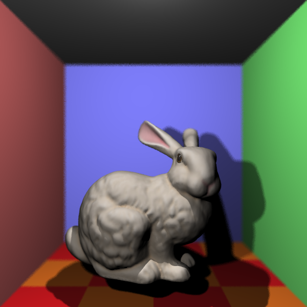
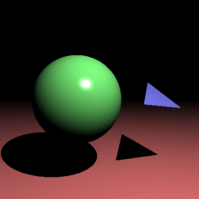
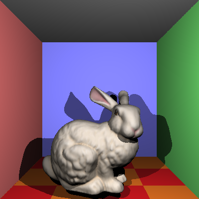
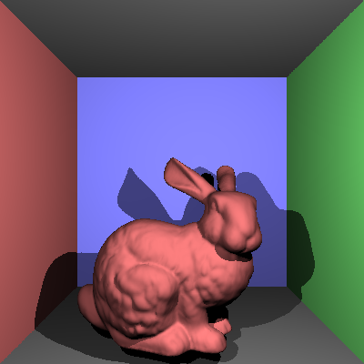

# COMP40019 - Project 1 - Ray Tracer

**Name:** Vadym Musiienko\
**Student Number:** 1785479 \
**Username:** vmusiienko \
**Email:** vmusiienko@student.unimelb.edu.au

## Completed stages

<!---
Tip: To tick, place an x between the square brackes [ ], like so: [x]
-->

##### Stage 1

-   [x] Stage 1.1 - Familiarise yourself with the template
-   [x] Stage 1.2 - Implement vector mathematics
-   [x] Stage 1.3 - Fire a ray for each pixel
-   [x] Stage 1.4 - Calculate ray-entity intersections
-   [x] Stage 1.5 - Output primitives as solid colours

##### Stage 2

-   [x] Stage 2.1 - Illumination
-   [x] Stage 2.2 - Shadow rays
-   [x] Stage 2.3 - Reflection rays
-   [x] Stage 2.4 - Refraction rays
-   [x] Stage 2.5 - The Whitted Illumination Model

##### Stage 3

-   [x] Stage 3.1 - Advanced features
-   [x] Stage 3.2 - Advanced add-ons
    -   [x] A.1 - Anti-aliasing
    -   [ ] A.2 - Soft shadows
    -   [x] A.3 - Depth of field blur
    -   [ ] A.4 - Motion blur
    -   [x] B.1 - Color texture mapping
    -   [ ] B.2 - Bump or normal mapping
    -   [ ] B.3 - Procedural textures
    -   [ ] C.1 - Simple animation
    -   [ ] C.2 - Keyframe animation
    -   [ ] C.3 - Camera animation

## Stage 3 implementation details

### Stage 3.1 - OBJ models and custom camera

To support OBJ models, I made three helper classes.

The first one is **ObjReader.cs**, which handles parsing the OBJ file. It takes the path to the OBJ file, a transform, and a material as arguments. It parses the file by creating a list of vertices (v), vertex normals (vn), and vertex texture coords (vt) if they exist. It also applies the transform to all vertices and normals before storing them. Once parsing is done, it passes the data to the BVH tree constructor, which builds a BVH tree (a structure for optimization), and then returns that tree back to **ObjModel.cs**.

The second file, **BVH.cs**, handles building the BVH tree. [This article](https://jacco.ompf2.com/2022/04/13/how-to-build-a-bvh-part-1-basics/) really helped me understand how to build a fairly optimized BVH, which sped up my rendering by more than 1000%. I built the bounding boxes by splitting along the longest axis of the parent box. This BVH uses the **BVHTriangle.cs** class for each face (basically like a triangle class, but with extra features specific to OBJ).

The third file, **BVHTriangle.cs**, just represents a face/triangle in an OBJ model. It’s basically an extension of the triangle class, but it doesn’t inherit from the `SceneObject` interface since it’s part of a scene object, not a full scene object itself.

To support camera rotation and transformation, I applied a quaternion rotation to each ray’s direction. For transformations, I just used the `Transform` class on each ray’s origin. Combining the rotated direction with the transformed origin gave me full flexibility to customize the camera however I wanted.

### Stage 3.2 A1 - Anti-aliasing

To avoid jagged or stair-stepped edges, I used **supersampling anti-aliasing (SSAA)** with a grid algorithm. (I learned about this from the [Wikipedia page](https://en.wikipedia.org/wiki/Supersampling).)

To implement grid SSAA, I cast `AAMult * AAMult` rays per pixel. For example, if `AAMult = 2`, that’s 4 rays per pixel; if `AAMult = 3`, then 9 rays, and so on. Conceptually, it’s like rendering the image at a higher resolution (e.g., 800×800 instead of 400×400) and then averaging it back down to the target resolution.

I used two extra loops to iterate through each subpixel. Each subpixel was centered by adding `0.5` to its x and y coordinates, then dividing by the number of subpixels per row (for x) or column (for y).

For every subpixel coordinate, I cast a ray and computed its color. I summed all these colors together, then divided by the number of samples (`AAMult * AAMult`) to get the final pixel color.

### Stage 3.2 A3 - Depth of field blur

To implement depth of field blur, I modified my camera. Whenever `apertureRadius` is greater than 0 (i.e., depth of field blur is enabled), I cast multiple rays per pixel (controlled by a constant, which I currently have set to 10).

In my ray casting function, I sample a random point on the aperture (basically a circle with radius `apertureRadius`) using [polar coordinates](https://en.wikipedia.org/wiki/Polar_coordinate_system) to ensure a uniform distribution. This random point serves as the **origin** of the ray after rotating it according to the camera’s orientation and adding it to the camera’s original position.

The next step is finding the **focal point** — the point that should be in focus. It’s computed as the camera’s original position plus the ray direction scaled by the focal length. With the focal point and the new ray origin, I compute the new ray direction as `(focalPoint - origin).Normalized()`. This gives me the offset ray used to simulate depth of field blur.

[This is the article I used to learn about depth of field blur and understand the process.](https://pathtracing.home.blog/depth-of-field/)

### Stage 3.2 B1 - Colour texture mapping

To implement color texture mapping, I first needed to store all the vertex texture coordinates from the OBJ file — thankfully, the OBJ reader already does this. So every OBJ face (an `OBJTriangle` instance) already has its 2D vertex texture coordinates.

To find the color at any point on a triangle, I use **barycentric coordinates**. These give each vertex a “weight,” which I multiply by the corresponding vertex coordinates to interpolate the texture coordinates for that point.

Once I have the interpolated texture coordinates for a point on the triangle, I pass them to the `RayHit` object (an optional argument I added as well as an overloaded constructor). When present, this tells the ray that it corresponds to a textured surface.

In the `Scene` class, instead of just reading the `DiffuseColor`, I call a `getDiffuseColor()` method. This method is overridden for textured materials (and just returns the diffuse color for normal materials). The overridden `getDiffuseColor()` method maps the texture coordinates to the image by multiplying them by the image width and height to get pixel x and y coordinates (1 - tex coord for y). Finally, I use these coordinates to fetch the pixel color from the texture image and return that value.

[This is the article I used to learn about texture mapping and understand the process.](https://medium.com/@Ksatese/advanced-ray-tracer-part-4-87d1c98eecff)

## Final scene render



This render took **35** minutes and **46** seconds on my PC. (Despite using the BVH for optimization, it took this long primarily because depth of field blur and anti-aliasing stack up, combined with the high resolution of 1000×1000.)

I used the following command to render the image exactly as shown:

```
dotnet run -- -f tests/final_scene.txt -o images/final_scene.png -l -r 0.04 -t 1.85 -x 2 -w 1000 -h 1000
```

## Stage 3.2 Before and After

### Anti-aliasing

| Before AA                                    | After AA                                    |
| -------------------------------------------- | ------------------------------------------- |
|  |  |

---

### Depth of field blur

| Before depth of field blur                    | After depth of field blur                    |
| --------------------------------------------- | -------------------------------------------- |
|  |  |

---

### Colour textures

| Before colour texture mapping                 | After colour texture mapping                 |
| --------------------------------------------- | -------------------------------------------- |
|  |  |

## References

1. [BVH tree construction guide](https://jacco.ompf2.com/2022/04/13/how-to-build-a-bvh-part-1-basics/)
2. [Supersampling anti-aliasing (Wikipedia)](https://en.wikipedia.org/wiki/Supersampling)
3. [Polar coordinates explanation](https://en.wikipedia.org/wiki/Polar_coordinate_system)
4. [Depth of field blur article](https://pathtracing.home.blog/depth-of-field/)
5. [Texture mapping article](https://medium.com/@Ksatese/advanced-ray-tracer-part-4-87d1c98eecff)
