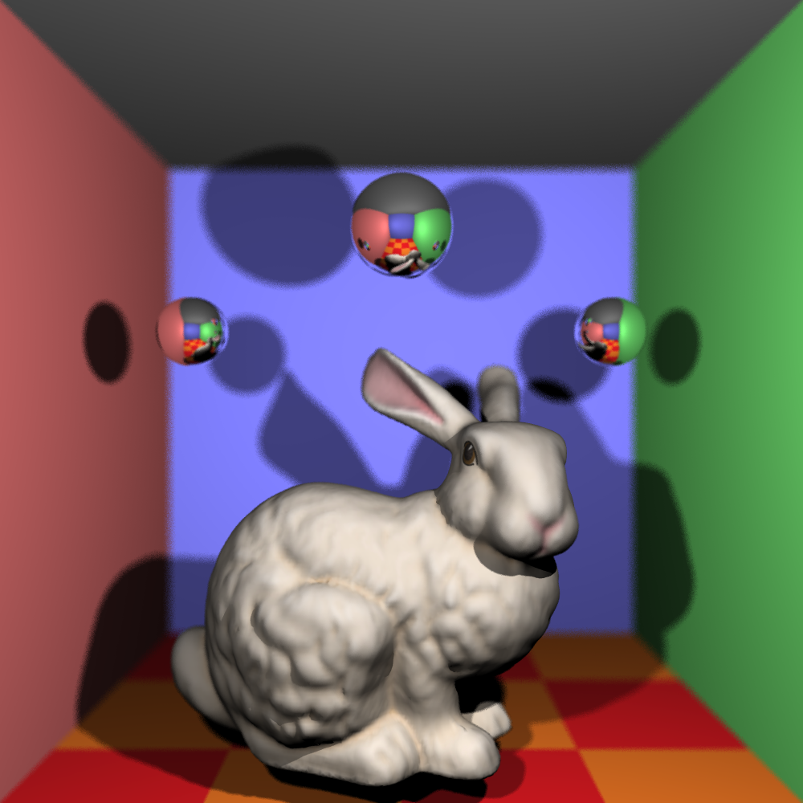

[](https://classroom.github.com/a/oMRiv2DB)
# COMP30019 - Project 1 - Ray Tracer

This is your README.md... you should write anything relevant to your
implementation here.

Please ensure your student details are specified below (*exactly* as on UniMelb
records):

**Name:** ... \
**Student Number:** XXXXXXX \
**Username:** ... \
**Email:** ...@student.unimelb.edu.au

## Completed stages

Tick the stages bellow that you have completed so we know what to mark (by
editing README.md). **At most 3** add-ons can be chosen for marking of stage three. If you complete more than this, pick your best one(s) to be marked, otherwise we will pick at random!

<!---
Tip: To tick, place an x between the square brackes [ ], like so: [x]
-->

##### Stage 1

- [x] Stage 1.1 - Familiarise yourself with the template
- [ ] Stage 1.2 - Implement vector mathematics
- [ ] Stage 1.3 - Fire a ray for each pixel
- [ ] Stage 1.4 - Calculate ray-entity intersections
- [ ] Stage 1.5 - Output primitives as solid colours

##### Stage 2

- [ ] Stage 2.1 - Illumination
- [ ] Stage 2.2 - Shadow rays
- [ ] Stage 2.3 - Reflection rays
- [ ] Stage 2.4 - Refraction rays
- [ ] Stage 2.5 - The Whitted Illumination Model

##### Stage 3

- [ ] Stage 3.1 - Advanced features
- [ ] Stage 3.2 - Advanced add-ons
  - [ ] A.1 - Anti-aliasing
  - [ ] A.2 - Soft shadows
  - [ ] A.3 - Depth of field blur
  - [ ] A.4 - Motion blur
  - [ ] B.1 - Color texture mapping
  - [ ] B.2 - Bump or normal mapping
  - [ ] B.3 - Procedural textures
  - [ ] C.1 - Simple animation
  - [ ] C.2 - Keyframe animation
  - [ ] C.3 - Camera animation

*Please summarise your approach(es) to stage 3 here.*

## Final scene render

Be sure to replace ```/images/final_scene.png``` with your final render so it
shows up here.



This render took **x** minutes and **y** seconds on my PC.

I used the following command to render the image exactly as shown:

```
dotnet run -- (... your command line args)
```

## Sample outputs

We have provided you with some sample tests located at ```/tests/*```. So you
have some point of comparison, here are the outputs our ray tracer solution
produces for given command line inputs (for the first two stages, left and right
respectively):

###### Sample 1

```
dotnet run -- -f tests/sample_scene_1.txt -o images/sample_scene_1.png
```

<p float="left">
  
   
</p>

###### Sample 2

```
dotnet run -- -f tests/sample_scene_2.txt -o images/sample_scene_2.png
```

<p float="left">
  
   
</p>

## References

*You must list any references you used - add them here!*

